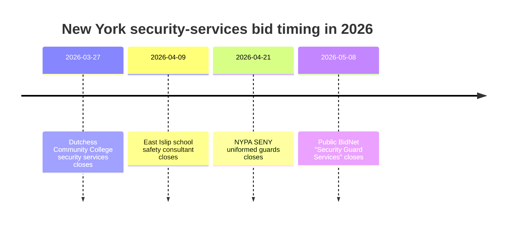

# 2026 New York Security Services RFP Scan

## Executive Summary

As of April 23, 2026, the public non-federal pipeline for New York security-services solicitations that fits all of your filters is thinner than it first appears. After excluding SAM.gov, NYC public schools, the MTA, and the specific opportunities you told me to omit, I found only **one high-confidence public match** with a **confirmed May 2026 due date**: a BidNet posting titled **“Security Guard Services”** published on April 16, 2026 and due May 8, 2026. The problem is that the public-facing landing page withholds the **agency name, solicitation number, buyer contact, scope, and documents** unless the vendor is logged in, so it is a real lead but not yet a fully qualified pursuit. citeturn46search0

The broader market picture is still useful. Several **strong near-miss** 2026 opportunities surfaced just outside your requested due-date window: entity["organization","Dutchess Community College","Poughkeepsie, NY, US"] issued an unarmed multi-site campus security RFP due March 27, 2026; entity["organization","East Islip School District","Islip Terrace, NY, US"] issued a school safety and security consultant RFP due April 9, 2026; and entity["organization","New York Power Authority","state public power authority"] issued a Southeastern New York uniformed guard RFP due April 21, 2026. Those are not “May/June/July” matches, but they strongly indicate which New York buyers are active, what scope types are being bought, and where a firm like Utica Security is most credible. citeturn34search1turn37search0turn31search5

A second important finding is that some of the most obvious state-office guard opportunities are likely **not rebidding this spring** because existing contracts run into 2028. Public contract records show multi-year guard contracts for New York labor-department offices and the Utica state office building running through January or August 2028, which likely suppresses near-term state-office rebid volume. That makes **school districts, colleges, local governments, public facilities, and specialized campuses** the better immediate hunting ground. citeturn24search13turn41search6turn41search7

## Scope and exclusions

This scan prioritized New York state and local government, non-NYC school districts, hospitals, parks, non-MTA transit authorities, counties, colleges, and similar public-facing institutions. I excluded the specific items you listed and did not use SAM.gov, NYC public-schools opportunities, or MTA-family solicitations in the recommendation set. Where possible, I favored official or primary procurement portals such as agency bid pages, BidNet agency pages, or New York procurement postings; where public visibility was limited, I used the public-facing procurement landing page and marked the missing fields explicitly. citeturn46search0turn34search1turn37search0turn31search5

## Matching RFPs

### Confirmed May through July match

| Agency | RFP title / ID | Brief scope | Issue date | Due date | Submission location / portal | Contact | Fit for Utica Security | Required certifications / insurance / training noted | Full notice / source | Missing info to verify |
|---|---|---|---|---|---|---|---|---|---|---|
| **Agency not publicly exposed on public landing page** | **Security Guard Services** / Ref. **0000420924** | Title indicates guard-services procurement in New York, but public scope text is locked | 04/16/2026 | **05/08/2026, 5:00 PM EDT** | BidNet Direct / Empire State Purchasing Group public landing page | Buyer contact locked on public page | **Maybe** — exact service family and timing match; sector, armed/unarmed mix, geography, and staffing model are still unknown | Not publicly visible on landing page | Public BidNet landing page citeturn46search0 | Issuing agency, solicitation number, scope, location, documents, insurance, training, and contact details are all hidden behind vendor registration |

At this snapshot, I did **not** find additional public New York opportunities that clearly met **all** of these conditions simultaneously: 2026 issue date, security-guard or closely related service, non-excluded buyer, and a confirmed May/June/July 2026 due date. The absence of more matches appears to be driven by a combination of buyer timing and portal gating rather than by lack of security demand. citeturn46search0turn24search13turn41search6turn41search7

### Timing map

The timeline below shows the one confirmed in-window match and the strongest near-miss signals that matter for pipeline strategy. citeturn34search1turn37search0turn31search5turn46search0

## Near-match intelligence that still matters

These opportunities fall **outside** your requested May/June/July due-date window, so I am not counting them as core matches. They are still worth using as **buyer intelligence**, **scope analogs**, and **re-engagement targets**.

| Agency | RFP title / ID | Brief scope | Issue date | Due date | Submission location / portal | Contact | Fit for Utica Security | Required certifications / insurance / training noted | Full notice / source |
|---|---|---|---|---|---|---|---|---|---|
| **entity["organization","Dutchess Community College","Poughkeepsie, NY, US"]** | **RFP-DCC-13-2026 – Security Services** | Unarmed guard services at the main campus, Fishkill campus, Family Partnership Center, and residence hall | 03/13/2026 | 03/27/2026, 2:00 PM EDT | Physical submission per BidNet notice | **entity["people","Michael Maher","procurement contact"]**; 845-431-8305; michael.maher@sunydutchess.edu | **Yes** — strong campus/public-institution fit; unarmed coverage, incident response, patrol, emergency support all align with a licensed NY guard firm | Licensed/trained guard services implied by scope; prevailing wage compliance noted; contractor registry compliance noted; **Crime/Fidelity Bond: $1,000,000** | BidNet notice and agency closed-bids page citeturn34search1turn34search2 |
| **entity["organization","East Islip School District","Islip Terrace, NY, US"]** | **RFP# 040926-1 School Safety and Security Consultant** | School safety and security consultant services for the 2026–2027 term | 03/12/2026 | 04/09/2026, 11:00 AM EDT | BidNet / district procurement posting | **entity["people","Jenny Bejarano","district procurement contact"]**; 631-224-2031; jenny.bejarano@eischools.org | **Maybe** — better fit if Utica wants a consulting/training-led role, not just guard staffing; DCJS training-provider credentials help | Public snippet does not show insurance package; consultant orientation suggests heavier emphasis on school-safety expertise and program design | BidNet notice and district closed-bids page citeturn37search0turn36search4 |
| **entity["organization","New York Power Authority","state public power authority"]** | **SENY Uniformed Security Guards** / Opportunity ID **2133363**, contract no. **Q26-7742BB** | Uniformed guard services across Southeastern New York NYPA sites | 03/26/2026 | 04/21/2026 | NYPA website via ARIBA platform | **entity["people","Brandon Baker","strategic buyer II"]**; 914-681-6449; brandon.baker@nypa.gov | **Maybe** — credible if Utica can scale to utility/regional operations; less ideal if the company is targeting school/hospital/municipal accounts first | **MWBE goal 30%** and **SDVOB goal 6%** were publicly stated; full technical/security requirements were not public in the snippet | Public opportunity summary citeturn31search5 |

## What the market says about best fit for Utica Security

The best-fitting public buyers in this research set are the ones buying **staffed guard coverage tied to public-facing operations** rather than highly specialized infrastructure or pure cybersecurity. The Dutchess Community College solicitation is the clearest analog: multi-site public campus coverage, licensed and trained guards, incident response, emergency coordination, and compliance-heavy guard operations. That profile is very close to a school/hospital/municipal guard-agency value proposition. citeturn34search1turn34search2

The East Islip consultant procurement is a different type of fit. It does **not** read like a conventional manned-guard staffing buy; it reads like a school-safety program and advisory role. That is only attractive if Utica wants to market its **DCJS training-provider** capability, school-safety planning support, tabletop exercises, or policy/program oversight — not just officers on post. For a pure guard-agency posture, it is a partial fit, not a perfect one. citeturn37search0turn36search4

The NYPA opportunity shows where the ceiling is higher but the bar is also higher. A utility-wide regional guard contract usually implies broader geographic coverage, deeper supervisory infrastructure, more formal subcontracting participation requirements, and potentially more sophisticated site-security expectations than a localized school or municipal account. It is not a bad target, but it is more likely a **“selective pursuit or partner pursuit”** than a routine bread-and-butter bid. citeturn31search5

The scarcity of visible May–July matches is also explainable. Public contract records show that several New York guard contracts for state-office and labor-department locations are already parked through 2028, including the Utica state office building and multiple New York labor-department offices. In practice, that means a late-spring 2026 chase should likely lean less on “generic state office guards” and more on **school districts, colleges, county facilities, specialty public venues, and local authorities**. citeturn24search13turn41search6turn41search7

## Recommended actions

### Immediate pursuit action

The May 8 BidNet posting is the only in-window lead I would put in the **act now** column. Because the public page hides the issuer, buyer, and documents, the first move is not proposal writing — it is **identity resolution**. Register or log in to the Empire State Purchasing Group / BidNet environment tied to that landing page, unlock the agency and documents, and qualify it within the same day. If the buyer turns out to be a school, municipal, campus, market, hospital, transit, or public-facility owner in New York, it stays live; if it is a poor geographic or operational fit, drop it fast. citeturn46search0

### Relationship targets

Even though they are closed, the strongest buyer families for future outreach are the Dutchess Community College and East Islip-type accounts. Those are the buyers most aligned with a New York licensed guard agency that can credibly speak to school and campus operations, incident reporting, de-escalation, training quality, and NY compliance. The NYPA-type account is worth pursuing only if Utica can show regional reach, stronger depth of field supervision, and either meaningful MWBE/SDVOB teaming or a clean explanation of how it will support participation requirements. citeturn34search1turn37search0turn31search5

### Contact script

Use a short, procurement-safe introductory note before the next cycle opens:

> Subject: New York licensed security-services capability for upcoming guard / safety procurements  
>  
> Hello [Buyer Name],  
> Utica Security Services is a New York licensed guard agency with experience supporting public-sector and institutional environments, including school, healthcare, and municipal-style security operations. In addition to staffed guard coverage, we can support training, de-escalation readiness, incident documentation, and post-order execution in compliance with New York requirements.  
>  
> We would appreciate being added to any vendor distribution lists for upcoming security-guard, school-safety, campus-security, or related public-facility solicitations. If permitted, we would also welcome a brief introduction call to better understand your operating environment and procurement calendar.  
>  
> Thank you,  
> [Name / title / phone / email / license information]

### Pursuit checklist

Before spending proposal time, verify these items for each lead:

- Buyer identity and facility type  
- Armed versus unarmed scope  
- Number of posts, hours, and coverage calendar  
- Geographic footprint and supervision burden  
- Prevailing wage applicability  
- Required bond, insurance, and subcontracting goals  
- Portal registration requirements and whether documents are login-gated  
- Whether the solicitation is staffing, consulting, training, or a blended scope  
- Whether the buyer is likely seeking a single-site operator or a regional platform vendor

## Open questions and limitations

The biggest limitation in this report is the **May 8, 2026 BidNet match**: the public-facing source confirms the title and due date but hides the agency, solicitation number, documents, buyer contact, and scope until vendor access is granted. That makes it a real lead, but not yet a fully qualified one. citeturn46search0

The second limitation is market visibility. A meaningful portion of New York state/local opportunity discovery currently sits behind portal logins or member-facing procurement systems. That means some additional spring 2026 opportunities may exist but are not fully inspectable from their public landing pages alone. The best evidence for that is the contrast between public-facing, fully visible BidNet agency pages like Dutchess Community College and partially locked statewide/public landing pages like the May 8 item. citeturn34search1turn46search0

The bottom line is straightforward: **there is one confirmed in-window lead to qualify immediately, and the strongest practical next targets are the buyer types reflected in the Dutchess, East Islip, and NYPA near-misses.** Those near-misses give you the clearest picture of who is buying, how they describe scope, and where Utica Security’s public-sector positioning is most likely to convert. citeturn34search1turn37search0turn31search5