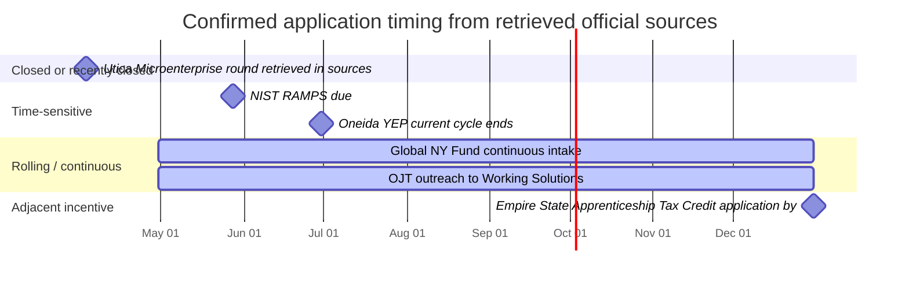

# Grant Landscape for Utica Security Services

## Executive summary

Utica Security Services’ official website supports a profile of a private security and training company offering guard services, executive protection, event security, commercial security, security consulting, New York State security guard training, digital fingerprinting through IdentoGO, and Pearson VUE testing services. It markets to construction sites, residential and commercial properties, industrial sites, banks, retail, office buildings, religious institutions, schools, and events. The site also states that the company is a New York licensed watch guard and patrol agency and a New York State Division of Criminal Justice Services approved security training provider. citeturn0view0turn1view0

The most important threshold issue is geographic eligibility. Although the prompt described the business as Utica-based, the current company website points to a Baisley Boulevard address in entity["place","Jamaica","Queens, New York, US"], describes the company as located in entity["place","Queens","New York City, New York, US"], and frames its vision around service in entity["city","New York City","NY, US"]. That means the strongest local opportunities in entity["city","Utica","New York, US"] and entity["place","Oneida County","New York, US"] are **conditional** on the company actually having — or being willing to establish — an eligible local footprint there. citeturn0view0turn1view0turn2view2

Given that baseline, the best near-term, highest-confidence funding paths are not classic public-safety equipment grants to the company itself. Instead, they are: employer-focused workforce reimbursements and training funds through entity["organization","Working Solutions","workforce board utica ny"] and the entity["organization","New York State Department of Labor","labor agency"]; export-assistance grants through entity["organization","Empire State Development","New York economic development"] if the business can sell exportable services; and local microenterprise/CDBG channels if the firm truly qualifies in Utica/Oneida geography. Public-safety grant programs such as the federal Nonprofit Security Grant Program, the New York Securing Communities Against Hate Crimes program, and the School Violence Prevention Program are still commercially relevant, but mostly as **vendor/partner opportunities** where the applicant is a nonprofit, school district, municipality, or law-enforcement entity — not the security company itself. citeturn23view0turn23view1turn17view0turn17view1turn5view4turn8view1turn22search0turn22search1turn27view0

The practical conclusion is straightforward. If the company wants **direct grant dollars**, the strongest fits are workforce and business-expansion programs. If it wants **grant-driven sales**, it should build pre-packaged security scopes for nonprofit, faith-based, school, and municipal clients pursuing their own security grants. The website reviewed does not identify the company as MWBE- or veteran-owned, so ownership-based grant or certification routes should be treated as contingent until verified. citeturn0view0turn1view0turn19search1turn19search4

## Company profile and eligibility baseline

Based on its website, Utica Security Services presents itself as a licensed private security and training platform in entity["state","New York","us state"] with a service mix that includes personal security and executive protection, guard services, event security, commercial security, consulting, state-approved guard training, digital fingerprinting, and professional test-center operations. The industries page and service descriptions suggest a client mix spanning private citizens, businesses, organizations, banks, religious institutions, schools, commercial properties, warehouses, and events. citeturn0view0turn1view0

That profile matters for grant fit. It supports four realistic funding theses. First, the company is an **employer** that can plausibly use hiring and training reimbursements. Second, it is a **training provider**, which opens some workforce-development and occupational-safety possibilities. Third, it serves **grant-eligible end users** such as nonprofits, schools, and houses of worship, which creates a strong indirect pipeline through partner grants. Fourth, it may have a narrow basis for **export assistance** if it offers exportable consulting, training, credentialing support, or security-adjacent services in foreign markets. citeturn0view0turn1view0turn23view0turn17view0turn17view1

What is missing is also important. The public website reviewed does not disclose headcount, revenue, named anchor clients, MWBE status, or veteran-owned status. It also does not substantiate a current Utica or Oneida County operating address. Those gaps do not prevent this analysis, but they materially affect eligibility screening for local grants and ownership-specific programs. citeturn0view0turn1view0

## Top opportunities comparison

The table below prioritizes programs by a combination of practical fit, source quality, and commercial usefulness. “Direct” means the company itself could be the applicant or direct beneficiary. “Indirect” means the company is more likely to win work as a vendor or partner to the actual grantee.

| Grant name                                                        | Source                                                                                                                                   | Purpose                                                                                                                | Eligibility                                                                                                                       | Award range                                                                                     | Deadline                                                                                                       | Link                                                                                                                                                                     | Notes                                                                                                                                                                                                                                                                            |
| ----------------------------------------------------------------- | ---------------------------------------------------------------------------------------------------------------------------------------- | ---------------------------------------------------------------------------------------------------------------------- | --------------------------------------------------------------------------------------------------------------------------------- | ----------------------------------------------------------------------------------------------- | -------------------------------------------------------------------------------------------------------------- | ------------------------------------------------------------------------------------------------------------------------------------------------------------------------ | -------------------------------------------------------------------------------------------------------------------------------------------------------------------------------------------------------------------------------------------------------------------------------- |
| On-The-Job Training                                               | Working Solutions / workforce board                                                                                                      | Wage reimbursement for training new hires                                                                              | Employers using structured OJT; local contacts listed for Oneida/Herkimer/Madison                                                 | Up to 50% of trainee wages reimbursed                                                           | No fixed deadline shown on active page                                                                         | [Official page](https://www.working-solutions.org/for-businesses/on-the-job-training)                                                                                    | **Best direct near-term fit** for a labor-intensive security firm hiring guards, dispatchers, trainers, or admin staff. Reimbursement, not a capital grant. citeturn23view0                                                                                                   |
| Existing Employee / New Hire / Unemployed Worker Training via CFA | Working Solutions / NYSDOL                                                                                                               | Training funds for business upskilling or new-hire development                                                         | Businesses using New York workforce training channels; NYSDOL funding page still lists EET/UWT materials                          | Up to $100,000; trainee cap $5,000                                                              | Monitor portal status; active funding hub exists but current round timing needs confirmation                   | [Working Solutions overview](https://www.working-solutions.org/for-businesses/resources-for-businesses) · [NYSDOL funding hub](https://dol.ny.gov/funding-opportunities) | **Good direct fit** for guard training, supervisory development, compliance, customer-service, and technology upskilling. Working Solutions cites live program economics, but timing should be revalidated before submission. citeturn23view1turn28search0                   |
| Community Development Block Grant business channels               | Oneida County                                                                                                                            | Small business assistance, economic development, and microenterprise support                                           | For-profit businesses creating or retaining jobs, primarily for low/moderate-income individuals; geography-dependent              | Varies; county page does not post a current cap                                                 | Next round not posted in retrieved source; last visible microenterprise application was submitted Apr. 5, 2024 | [Official page](https://oneidacountyny.gov/departments/planning/economic-development/cdbg/)                                                                              | **Direct local fit only if the company truly has or creates an eligible Oneida County footprint.** Strong if opening a local office or expanding staffing there. citeturn5view4turn9view3turn1view0                                                                         |
| City of Utica Microenterprise Grant Program                       | City of Utica                                                                                                                            | Small-capital and working-capital support for MWBE microenterprises                                                    | Minority- and/or women-owned businesses in Utica with 10 or fewer employees; LMI job rules apply                                  | $5,000 to $15,000                                                                               | Apr. 3, 2026 at 12:00 p.m. for the retrieved round                                                             | [Official page](https://www.cityofutica.com/departments/urban-and-economic-development/business/MWBE-grant-program/index)                                                | **Excellent direct fit if — and only if — the company is MWBE-qualified and actually located in Utica.** Requires application, employment plan, personal financial statement, employee questionnaires, business plan, and organizational documents. citeturn8view0turn8view1 |
| Global NY Fund Grant Program                                      | Empire State Development                                                                                                                 | Export market entry/expansion                                                                                          | NYS companies with 500 or fewer NY employees and exportable products/services                                                     | Up to $25,000; reimburses up to 50% of project cost                                             | Continuous basis; average processing time about 90 days                                                        | [Official page](https://esd.ny.gov/global-ny-fund-grant-program)                                                                                                         | **Good direct fit if the company can credibly define exportable security consulting, training, or services.** Stronger than most people assume for service businesses. citeturn17view1                                                                                        |
| Global NY State Trade Expansion Program                           | Empire State Development in partnership with the entity["organization","U.S. Small Business Administration","federal small business"] | Reimbursement for export missions, translation, marketing, training, compliance testing, and related export activities | For-profit NYS business with physical employee presence, 1+ year in operation, export-ready goods or services, SBA size compliant | Up to $10,000; latest posted guideline said 50% of eligible costs                               | Current page is live, but latest posted guideline window ended Feb. 28, 2026; confirm next tranche             | [Official page](https://esd.ny.gov/global-ny-state-trade-expansion-program-step)                                                                                         | **Direct but conditional.** Useful only if management intends to pursue international security consulting/training or related service export. citeturn17view0turn16search2                                                                                                   |
| Occupational Safety and Health Training and Education Program     | NYSDOL Hazard Abatement Board                                                                                                            | Funding for occupational safety and health training and education                                                      | Supports employers, labor unions, schools, nonprofits, and trade groups delivering OSH training                                   | Page shows approx. $5.9 million statewide pool; applicant award size not stated on landing page | RFP live; due date not captured in retrieved page, so check the RFP immediately                                | [Official page](https://dol.ny.gov/bc/hab)                                                                                                                               | **Potentially strong if the company expands its training arm** into workplace safety, violence prevention, incident response, or related employer education. citeturn29view0                                                                                                  |
| Securing Communities Against Hate Crimes                          | New York State                                                                                                                           | Security improvements for at-risk nonprofits/community organizations                                                   | Nonprofit, community-based organizations at risk because of ideology, beliefs, or mission                                         | Retrieved source shows up to $70 million statewide; applicant-level caps not captured           | Open as of Apr. 15, 2026; closing date not captured in retrieved page                                          | [Apply page](https://www.governor.ny.gov/apply-securing-communities-against-hate-crimes-grant-program)                                                                   | **Important indirect pipeline.** Utica Security Services could package guard services, hardening support, risk assessments, or implementation support for eligible nonprofit clients. citeturn22search1turn22search3                                                         |
| Nonprofit Security Grant Program                                  | FEMA / NY DHSES                                                                                                                          | Physical and cybersecurity/target-hardening for at-risk nonprofits                                                     | Nonprofit organizations apply as subapplicants; in New York, application administration runs through DHSES                        | Up to $200,000 per site in the retrieved FY2025 notice                                          | FY2025 NY application period closed Jan. 13, 2026                                                              | [NY DHSES page](https://www.dhses.ny.gov/nonprofit-programs)                                                                                                             | **High-value indirect pipeline** because the firm already markets to religious institutions and schools. Best used to sell grant-aligned security scopes to nonprofit clients. citeturn22search0turn20search6                                                                |
| School Violence Prevention Program                                | DOJ COPS Office                                                                                                                          | School safety technology, coordination, training, locks, lighting, detectors, emergency notification                   | States, local governments, school districts, tribes, and public agencies — not private firms                                      | Up to $500,000 federal share; 25% local cash match; up to 75% federal participation             | FY25 closed June 26, 2025                                                                                      | [Official page](https://cops.usdoj.gov/svpp)                                                                                                                             | **Indirect partnership opportunity** for school districts, municipalities, and law enforcement agencies needing security planning or implementation vendors. citeturn27view0                                                                                                  |

### Interpreting the table

For a company with this service profile, the **highest-probability direct dollars** are the workforce and business-support channels: OJT, CFA-linked training funds, Global NY export grants, and possibly NYSDOL/HAB if the firm leans harder into training. The **highest-probability grant-driven revenue** comes from programs where the client is the grantee: NSGP, SCAHC, and SVPP. The one program that looks attractive but must be treated carefully is the Utica city microenterprise grant, because it is only a true fit if the firm actually qualifies on both geography and MWBE requirements. citeturn23view0turn23view1turn17view1turn29view0turn22search0turn22search1turn27view0turn8view1

### Key contacts

The most actionable contact points captured in official sources are these:

- **Working Solutions**: Caitlin McSorley, 315-207-6951 ext. 145; Art Rapp, 315-798-3679; YEP coordinator Zuleyka Febo, 315-207-6951 ext. 144. citeturn23view0turn23view1turn23view2
- **City of Utica**: Jack N. Spaeth, Economic Development Program Specialist, 315-792-0195, jspaeth@cityofutica.com. citeturn8view0turn8view1
- **Global NY / ESD**: general contact 212-803-2300 and globalny@esd.ny.gov; Mohawk Valley regional contact Kathryn Bamberger; New York City regional contact Brian Teubner. citeturn17view0turn17view1
- **NYSDOL / HAB**: Beth Geleta, Workforce Programs Manager 1, 518-402-0455. citeturn29view0
- **NSGP in New York**: nsgp@dhses.ny.gov. citeturn22search0
- **COPS Office**: 800-421-6770 and askcopsrc@usdoj.gov. citeturn27view0
- **NIST NICE / RAMPS**: nice@nist.gov; the NOFO materials also list Susana Barraza for programmatic questions. citeturn12search1turn10search1

## Additional leads

The following leads are worth tracking even though they are secondary, more conditional, or are not classic grants.

**NIST RAMPS cybersecurity workforce development.** The entity["organization","National Institute of Standards and Technology","standards agency"] RAMPS opportunity anticipates up to sixteen awards of up to $200,000, requires a 50% non-federal match, and is due May 28, 2026. This is only a fit if the company is willing to build a cybersecurity-workforce consortium with schools and employers rather than submit a standard guard-services proposal. citeturn12search0turn12search1turn12search2

**Working Solutions apprenticeship support.** The apprenticeship page says the board has apprenticeship grants to help expand apprenticeship pathways and references the RADAR project. This is useful if the firm wants to create a structured pathway for security technology, dispatch, operations, or compliance roles, even if it is not a traditional armed/unarmed guard apprenticeship. citeturn25view0

**Empire State Apprenticeship Tax Credit.** This is not a grant, but it is financially meaningful if the company creates a registered apprenticeship track. NYSDOL says applications must be received by December 31, 2026. citeturn14search7turn28search18

**New York Youth Jobs Program.** Also not a grant, but the statewide program offers participating businesses tax credits up to $7,500 per eligible hire and is reauthorized through 2027. This can help if the company wants a pipeline for office, support, or trainee roles. citeturn28search19

**MWBE certification.** The website review did not show MWBE status, but if ownership qualifies, New York State certification can open contracting and business-development channels, and it is directly relevant to the City of Utica microenterprise program. citeturn19search4turn8view1

**SDVOB certification.** If ownership qualifies, the New York SDVOB program is not a grant program, but it is a strong route into state procurement. OGS states eligible firms must be small businesses with significant business presence in New York. citeturn19search1turn19search5

**NYC M/WBE certification.** If the company is truly operating from Queens rather than Utica, New York City M/WBE certification may be more commercially relevant than Mohawk Valley local grants. The city program helps businesses access city buyers and contracts. citeturn19search0

**Global NY Export Marketing Assistance Service.** This is not a cash grant, but it is official export-development assistance for New York firms with exportable services and can complement Global NY Fund and STEP. citeturn16search4

**Homeland Security Grant Program partnerships.** The federal homeland security suite primarily funds state, local, tribal, and territorial preparedness activities, not private security firms directly. But it remains relevant as a partnership and vendor channel. citeturn20search18

**City of Utica annual CDBG and business channels.** The City’s CDBG infrastructure and business pages are worth monitoring annually, especially if the company develops a real Utica presence. Retrieved sources show the city runs entitlement-funded programs and annual funding processes. citeturn7search2turn7search5

**Oneida County / Mohawk Valley business ecosystem.** Oneida County points businesses toward Mohawk Valley EDGE and local economic-development coordination; this is useful for finding future county-mediated business assistance or municipal-economic-development projects even when a live grant is not posted. citeturn6search18

**Working Solutions employer services.** The board’s business resources page is useful beyond grants because it aggregates training, recruitment, and incentives in Oneida/Herkimer/Madison counties, which can reduce labor costs even when outright grants are unavailable. citeturn23view1turn24search4

## Recommended next steps

The single most important next step is to resolve geography. Management should decide whether the company is truly operating as a Queens/NYC business, a Utica/Oneida business, or both. Without that answer, local-grant strategy will be inefficient and possibly ineligible. If the goal is to pursue Mohawk Valley funding, establish or document the operating site, payroll, and business-registration footprint that local programs will ask for. The website evidence currently points the other direction. citeturn1view0turn2view2

The next move should be to open three conversations immediately. First, speak with Working Solutions about OJT and related business training funds. Second, speak with Global NY to determine whether the company has a plausible export story for consulting, training, or testing services. Third, if a real Utica/Oneida footprint exists or is planned, contact the City of Utica and county economic-development/CDBG administrators to determine whether the next local round will be open and what proof of local operations they expect. citeturn23view0turn23view1turn17view0turn17view1turn8view1turn5view4

At the same time, the firm should build a **grant-ready internal package**. The reusable file should include updated formation documents, New York good-standing evidence, service descriptions, training curricula, trainer credentials, a current insurance package, an employee roster, a hiring plan, and a two-page company capability statement. This recommendation is an inference from the repeated document demands visible across the Utica microenterprise materials, federal grant instructions, and Global NY application requirements. citeturn8view0turn8view1turn17view1turn10search1

The commercially smartest parallel track is a **client-facing grant sales strategy**. Because the company already markets to religious institutions, schools, and community-facing properties, it should create pre-scoped packages for nonprofit and school applicants: vulnerability assessment support, site walk-throughs, pricing for hardening measures, training modules, staffing plans, implementation schedules, and post-award procurement support. That makes the company easier to buy under NSGP, SCAHC, and SVPP-funded projects. This is an inference from the allowable uses and applicant structures of those programs. citeturn22search0turn22search1turn27view0

Finally, if ownership may qualify as MWBE or SDVOB, certification should be treated as a strategic project, not an administrative afterthought. It will not create grant eligibility by itself in every case, but it can materially improve access to contracts and make the Utica MWBE microenterprise route viable if the company truly has a Utica presence. citeturn19search1turn19search4turn8view1

## Application checklist and timeline

A realistic baseline application file should include the following materials because they are explicitly required across the programs retrieved or are directly implied by those requirements:

- Proof of legal entity formation and authority to do business in New York. The Utica program explicitly asks for organizational documents, and Global NY requires New York registration and business viability. citeturn8view0turn17view0turn17view1
- A concise business or project narrative. The Utica program requires at least a one-page business plan; Global NY requires a grant application and line-item budget; federal opportunities require formal narratives and executive summaries. citeturn8view0turn8view1turn17view1turn10search1
- Budget and match documentation. Global NY is reimbursable; STEP is cost-shared; NIST RAMPS requires a 50% match; SVPP requires a 25% local cash match. citeturn17view1turn16search2turn10search1turn27view0
- Employment and training documentation. OJT requires structured training tied to the job; the Utica program requires an employment plan and employee questionnaires; CDBG pathways depend heavily on job creation/retention outcomes. citeturn23view0turn8view0turn8view1turn5view4
- Financial disclosures where required. The Utica materials explicitly require a personal financial statement. citeturn8view0
- Federal and state registrations when applicable. Federal grants commonly require UEI/SAM; the New York NSGP page advises future applicants to complete SFS prequalification, obtain a UEI, and ensure Charities Bureau registration where applicable. citeturn10search1turn22search0
- Vulnerability assessments for client-facing nonprofit grants. SCAHC applicants must provide vulnerability assessments, and NSGP is structured around target-hardening and risk justification. citeturn22search1turn20search6

Only a few deadlines were clearly confirmed in the retrieved sources, so the timeline below shows the dates that can be acted on with high confidence right now. citeturn12search1turn23view2turn8view1turn17view1turn28search18

## Open questions and limitations

The biggest unresolved issue is the company’s actual operating geography. The official website reviewed supports Jamaica/Queens/NYC, not Utica. That means the Oneida County and City of Utica paths in this report should be treated as contingent until management confirms an eligible local presence. citeturn1view0turn2view2

Several official pages retrieved did not expose every detail the request asked for, especially applicant-level award caps or exact 2026 closing dates for some state and local programs. Where that happened, the report explicitly says so instead of inventing a number. The most affected opportunities are Oneida County CDBG, NYS SCAHC, and NYSDOL/HAB OSH T&E. citeturn5view4turn22search1turn29view0

Finally, the website review did not confirm MWBE or veteran ownership status, employee size, or export intent. Those facts will determine whether the strongest local and certification-linked opportunities are truly usable. citeturn0view0turn1view0turn19search1turn19search4

working-solutions.org
working-solutions.org

2
https://www.working-solutions.org/for-businesses/on-the-job-training
https://www.working-solutions.org/for-businesses/on-the-job-training

3
https://www.working-solutions.org/for-businesses/resources-for-businesses
https://www.working-solutions.org/for-businesses/resources-for-businesses

14
https://www.working-solutions.org/training-grant-programs/apprenticeships
https://www.working-solutions.org/training-grant-programs/apprenticeships
oneidacountyny.gov
oneidacountyny.gov

4
CDBG | Oneida County
https://oneidacountyny.gov/departments/planning/economic-development/cdbg/

23
Economic Development
A coordinated economic development program that can assist your business to locate, grow and prosper in Oneida County, in the center of New York State.Read more
cityofutica.com
cityofutica.com

5
https://www.cityofutica.com/departments/urban-and-economic-development/business/MWBE-grant-program/index
https://www.cityofutica.com/departments/urban-and-economic-development/business/MWBE-grant-program/index

22
https://www.cityofutica.com/departments/urban-and-economic-development/community-development-programs/cdbg-information/index
https://www.cityofutica.com/departments/urban-and-economic-development/community-development-programs/cdbg-information/index
esd.ny.gov
esd.ny.gov

6
https://esd.ny.gov/global-ny-fund-grant-program
https://esd.ny.gov/global-ny-fund-grant-program

7
https://esd.ny.gov/global-ny-state-trade-expansion-program-step
https://esd.ny.gov/global-ny-state-trade-expansion-program-step

17
https://esd.ny.gov/doing-business-ny/mwbe
https://esd.ny.gov/doing-business-ny/mwbe

20
https://esd.ny.gov/export-marketing-assistance-service-program
https://esd.ny.gov/export-marketing-assistance-service-program
dol.ny.gov
dol.ny.gov

8
https://dol.ny.gov/bc/hab
https://dol.ny.gov/bc/hab

15
https://dol.ny.gov/apprenticeship/options-apprenticeship-program-sponsors
https://dol.ny.gov/apprenticeship/options-apprenticeship-program-sponsors

16
https://dol.ny.gov/youthjobs
https://dol.ny.gov/youthjobs
governor.ny.gov
governor.ny.gov

9
https://www.governor.ny.gov/news/governor-hochul-announces-70-million-available-help-protect-community-based-organizations
https://www.governor.ny.gov/news/governor-hochul-announces-70-million-available-help-protect-community-based-organizations
dhses.ny.gov
dhses.ny.gov

10
https://www.dhses.ny.gov/nonprofit-programs
https://www.dhses.ny.gov/nonprofit-programs
cops.usdoj.gov
cops.usdoj.gov

11
https://cops.usdoj.gov/svpp
https://cops.usdoj.gov/svpp
nist.gov
nist.gov

12
https://www.nist.gov/news-events/events/2026/04/applicants-webinar-2026-nice-ramps-funding-opportunity
https://www.nist.gov/news-events/events/2026/04/applicants-webinar-2026-nice-ramps-funding-opportunity

13
https://www.nist.gov/news-events/news/2026/04/new-funding-fuel-your-cybersecurity-workforce-development-efforts
https://www.nist.gov/news-events/news/2026/04/new-funding-fuel-your-cybersecurity-workforce-development-efforts
ogs.ny.gov
ogs.ny.gov

18
https://ogs.ny.gov/veterans/service-disabled-veteran-owned-business-certification
https://ogs.ny.gov/veterans/service-disabled-veteran-owned-business-certification
nyc-business.nyc.gov
nyc-business.nyc.gov

19
https://nyc-business.nyc.gov/nycbusiness/description/minority-and-womenowned-business-enterprise-certification-program-mwbe
https://nyc-business.nyc.gov/nycbusiness/description/minority-and-womenowned-business-enterprise-certification-program-mwbe
fema.gov
fema.gov

21
https://www.fema.gov/grants/preparedness/homeland-security
https://www.fema.gov/grants/preparedness/homeland-security
files.simpler.grants.gov
files.simpler.grants.gov

25
https://files.simpler.grants.gov/opportunities/37631ee7-9ec6-48ac-b895-119e3a013856/attachments/f4a1759f-2dcf-437b-b62e-a52075af458f/FY26_RAMPS_NOFO.pdf
https://files.simpler.grants.gov/opportunities/37631ee7-9ec6-48ac-b895-119e3a013856/attachments/f4a1759f-2dcf-437b-b62e-a52075af458f/FY26_RAMPS_NOFO.pdf
Sources scanned · 301

uticasecurityservices.com
uticasecurityservices.com
Home - UTICA SECURITY SERVICES

Total lines: 241

About Us - UTICA SECURITY SERVICES

Total lines: 151

files.simpler.grants.gov
files.simpler.grants.gov
Page 1 of 31 RAMPS CYBERSECURITY EDUCATION ...

Apr 13, 2026 — RAMPS CYBERSECURITY EDUCATION AND WORKFORCE DEVELOPMENT. Notice of Funding Opportunity. April 13, 2026. 2. Funding Availability. In FY26, NIST ...Read more

1 FY 2026 Notice of Funding Opportunity Port Infrastructure ...

Mar 25, 2026 — Projects to fund workforce training not related to electrification technology are ineligible. ... private corporation, please list the.Read more

FY26*All_CTR_Non-Proliferation_Programing_NOFO*- ...

Plan and organize trainings to strengthen physical security practices at technology firms and engage staff on threat vectors and vulnerability assessments.Read more

FINANCIAL ASSISTANCE FUNDING OPPORTUNITY ...

... workforce training program for this specific technology being developed to meet demand or to teach new skills necessary for emerging technologies? This may ...Read more

FY 2025 Notice of Funding Opportunity MBDA Women's ...

Mar 17, 2025 — Applications must be submitted electronically via grants.gov. Applicants are responsible for ensuring the completeness of their application.Read more

FY26 VGF Notice Amendment

3 days ago — AmeriCorps anticipates notifying successful applicants in July 2026. • AmeriCorps anticipates issuing awards in August 2026. Table of Contents.Read more

fy26-ols-nlgl-NOFO.pdf

Now more than ever, we are thrilled to support America's libraries, which can and should serve as civic centers of learning and culture for a nation of ...

Notice of Funding Opportunity - Open Data Framework

Application Deadline June 26, 2026 ... Resubmitted Application: A project application that was previously submitted to a program, but the application was.Read more

regionalcouncils.ny.gov
regionalcouncils.ny.gov
Governor Hochul Announces More Than $15 Million Awarded ...

5 days ago — Grants Through Empire State Development's Office of Strategic Workforce Development Will Support Efforts Throughout the State.

esd.ny.gov
esd.ny.gov
Office of Strategic Workforce Development

Funding supports a $150 million workforce development grant program, administered by OSWD, that will support employer-driven, high skilled workforce training ...Read more

Governor Hochul Announces More Than $15 Million Awarded ...

Mar 6, 2026 — Governor Kathy Hochul today announced that more than $15 million has been awarded to 13 workforce development projects across nine regions ...Read more

START-UP NY Program - Empire State Development

The START-UP NY Program is closed to new applicants as of January 1, 2026. START-UP NY helps new and expanding businesses through tax-based incentives and ...Read more

FAST NY Shovel-Ready Grant Program

Under New York's FAST NY Shovel-Ready Grant Program, Empire State Development will provide up to $400 million in grants to prepare and develop sites statewide.Read more

Division of Small Business & Technology Development

Find state and federal programs and tools including free resources — from workforce training and development to free English language instruction — available to ...Read more

Governor Hochul Announces New Initiative to Accelerate ...

Mar 6, 2026 — Empire State Development (ESD) provided a $3 million grant, matched by contributions from regional funders convened by the Adirondack Community ...Read more

Financial support to grow your business in New York State

Learn how New York State is committed to growth support for companies who move to or expand their business in NY with programs, grants, funds & more.

Pay for Performance Operating Grant Program

The Pay for Performance Operating Grant Program will support the operational resource needs of workforce training programs offering specialized job training.Read more

NYS Urban Development Corporation Directors' Meeting 4th ...

Feb 19, 2026 — ... rolling basis starting on or about Spring 2026, until funding is exhausted. ESD will administer funds consistent with program guidelines and ...Read more

New York State Community World Cup Grant Program

This program represents a coordinated effort to extend the benefits of the 2026 FIFA World Cup to all corners of New York State while supporting communities in ...Read more

POWER UP Grant Program - Empire State Development

Applications will be accepted on a rolling basis through the CFA Portal. ... Awards will be allocated on a rolling basis until funding is exhausted. ESD ...Read more

Key Budgetary Changes Affecting Small Businesses - FY24 to ...

employer expectations. Summary: The WRT Program will save New York businesses money and time by training individuals in the critical skills required for ...Read more

NEW YORK STATE URBAN DEVELOPMENT CORPORATION ...

In addition, the Office of Strategic Workforce Development was established to support workforce and economic development initiatives throughout the state, such ...Read more

Key Budgetary Changes Affecting Small Businesses - FY23 to FY24

literacy, job-seeking skills, and understanding employer expectations. Summary: The WRT Program will save New York businesses money and time by training.

Life Science Initiative - Empire State Development

Through a newly established focus on workforce development and sustained efforts in other grant programs, the Initiative is making sure life science ...Read more

Key Budgetary Changes Affecting Small Businesses - FY 21 ...

EET Program funds are available to provide occupational skills training courses for employed, existing workers seeking to enter or remain in middle-skill.Read more

NYS Urban Development Corporation Directors' Meeting 4th ...

Mar 27, 2025 — Grantee applied for a Capital Grant through the of Office of Strategic Workforce Development. (“OSWD”) grant funding. Based on the ...Read more

NYS Urban Development Corporation Directors' Meeting 37th ...

Jun 25, 2024 — ... Grant Program – Empire State Development. (“ESD”) Capital Appropriation (Capital Grants). Authorization to Adopt Guidelines; and Authorization ...Read more

NYS Urban Development Corporation Meeting 4th Floor ...

Sep 19, 2024 — ... workforce development, education, community investment and housing. ... new production facility in Dunkirk, New York. She stated the grant ...Read more

EMPIRE STATE NEW MARKET CORPORATION

Sep 5, 2024 — Vilardo explained that the Directors were asked to approve a $17 million grant to the Gorge Gateway Park and Hydraulic Power Plaza to be used ...Read more

11:30 AM ET Master Page # 1 of 275 - NYS Urban

Nov 16, 2023 — Operating Grant through Round 1 of Office of Strategic Workforce Development (“OSWD”) grant funding. Based on the recommendation of the OSWD ...Read more

NYS Urban Development Corporation Meeting Thursday, 9/15 ...

Apr 1, 2024 — DEVELOPMENT – Office of Strategic Workforce Development Grant Programs –. Authorization to Adopt Guidelines and to Take Related Actions ...Read more

new york state urban development corporation

Jun 29, 2017 — ... Development works to promote business investment and growth that leads to job creation and prosperous communities across New York State. AGENDA.Read more

Global NY State Trade Expansion Program (STEP)

Empire State Development (ESD) is working in partnership with the U.S. Small Business Administration (SBA) to increase the number of small businesses that ...Read more

Global NY Export Assistance - Empire State Development

Global NY programs connect companies with sales agents and distributors abroad and offset the costs of exporting with grants and loans.Read more

Global NY State Trade Expansion Program (STEP) STEP 12

Empire State Development (ESD) is working in partnership with the U.S. Small. Business Administration (SBA) to increase the number of small businesses that ...Read more

Global NY Fund Grant Program - Empire State Development

The Global NY Fund provides grants and loans to help New York State's small- and medium-sized businesses go global and create new jobs.Read more

Export Marketing Assistance Service Program

The Export Marketing Assistance Service (EMAS) is a New York State program designed to help businesses find sales agents or distributors abroad.Read more

Governor Hochul Announces More Than $43 Million in FAST ...

Dec 12, 2025 — ... New York grant program. FAST NY is designed to prepare and develop sites across the state to jumpstart New York's shovel-readiness and ...Read more

Empire State Development Launches Pilot Program To ...

Mar 26, 2026 — Empire State Development Launches Pilot Program To Prepare Community College Students For Careers In New York's Life Sciences Industry. March 26 ...Read more

ESD Provides Update on Next Steps for Revitalization of the ...

Mar 20, 2026 — The Governor has proposed another $100 million for the program in her 2026-2027 Executive Budget. Contact: Pamm Lent (ESD) | pamm.lent@esd.ny ...Read more

Empire State Development Announces Application Window ...

Oct 2, 2025 — Startups from around the globe are invited to apply for a chance to secure funding, expert mentorship, and a foothold in the Finger Lakes Region ...Read more

Empire State Development Announces Startups Selected For ...

Empire State Development Announces Startups Selected For Round Nine Of Luminate NY Accelerator. March 18, 2026. Strategic Support and Investment Fast-Tracks ...Read more

Empire State Development Announces Opening of The Green ...

Apr 16, 2026 — $34 Million Education and Welcome Center Supported by $1.5 Million From Empire State Development. Restored Landmark Greenhouse Anchors New ...Read more

Minority & Women's Business Development

Learn more about gaining MWBE certification & business development assistance through the Division of Minority and Women's Business Development (DMWBD).

oneidacountyny.gov
oneidacountyny.gov
CDBG

Apr 5, 2024 — Economic Development and Small Business grants are awarded to for-profit businesses to create or retain employment, primarily for low-and ...Read more

Oneida County Youth Bureau Seeks 2026 Grant Applications

Aug 20, 2025 — County Executive Anthony J. Picente Jr. announced today that the Oneida County Youth Bureau is accepting 2026 grant applications for ...Read more

2026-Adopted-Budget.pdf

Cost Center Total: 7240 - Utica Zoological. Cost Center: 7250 - NEXUS Center ... Federal Aid - Other Public Safety BOCES - Safe Schools Grant. 82,306.00.Read more

RFP 2026 Submission

County News · Projects · How Do I? County · Cnty Exec · County · YouTube. Oneida County NEW YORK. 800 Park Avenue. Utica, NY 13501. 315-798-5700 · Contact.Read more

RFPs

Available RFPs. RFPs may be obtained by the following button below: Open RFP. RFP #2026-451 Mohawk Valley Community ...Read more

Picente Announces Family Daycare Startup Grant Program

Sep 10, 2024 — County Executive Anthony J. Picente Jr. today announced a Family Daycare Startup Grant Program that would provide $250,000 to create new ...Read more

Oneida County Business Information

Oneida County 2026 Adopted Budget (PDF) · Archives · Child Advocacy Center · County Attorney · FOIL Request · County Clerk · DMV · Apostille · Business ...Read more

Agencies We Fund

Oneida County 2026 Adopted Budget (PDF) · Archives · Child Advocacy Center · County Attorney · FOIL Request · County Clerk · DMV · Apostille · Business ...Read more

Welcome To Oneida County | Oneida County

You are at the true source of valuable resources and insight to help residents, businesses, and local governments grow here in Oneida County, New York.

Unified Planning Work Program (UPWP) 2025-2026

Upon contract execution by the. State DOT, Oneida County will release an RFP for the Mobility Management. Project in early 2025. HOCTC anticipates submitting a ...Read more

Economic Development

A coordinated economic development program that can assist your business to locate, grow and prosper in Oneida County, in the center of New York State.Read more

Oneida County Breaks Ground on Cornell Cooperative ...

Aug 13, 2025 — Oneida County broke ground today on a $7.2 million expansion project that will add 16,000 square feet of office, conference and support ...Read more

Oneida County Purchasing Director

The Director and the Division of Purchase strive to provide the departments with goods and services they need while obtaining the best possible price.Read more

Oneida County Government Services and Resources

Our departments cover a full range of needs for families, businesses, and organizations to grow and prosper and improve our communities for years to come.Read more

Picente Announces State Grant to Launch Wellness ...

Mar 5, 2026 — March 5, 2026 - County Executive Anthony J. Picente Jr. today announced that Oneida County has been awarded a $60000 grant from the New York ...

Region Questionnaire Questions & Answers

Apr 5, 2024 — The project will be a microenterprise grant program offered to applicants either starting or expanding a microenterprise within non-CDBG ...Read more

2026 Oneida County Budget Approved

Nov 12, 2025 — The 2026 budget appropriates $149.4 million in sales tax revenue, $26.25 million in Oneida Indian Nation revenue and the capital plan retires ...Read more

grants.gov
grants.gov
View Grant Opportunity

Category of Funding Activity: Opportunity Zone Benefits Science and Technology and other Research and Development. Category Explanation: Expected Number of ...Read more

View Grant Opportunity

The NIST NICE program is seeking applications from eligible applicants for activities to establish community-based partnerships to develop cybersecurity career ...Read more

View Grant Opportunity

UPDATE APRIL 14, 2026: Proposals for the FY26 Small Grants Program will be reviewed on a rolling basis based on funding availability. Please follow all ...Read more

Nonprofit Security Grant Program

The Fiscal Year (FY) 2025 Nonprofit Security Grant Program (NSGP) improves and increases the physical/cybersecurity and facility/target hardening of nonprofit ...Read more

View Grant Opportunity

Announcement posted: April 13 2026. Closing date for applications: May 4, 2026. Funding type: Grant or Fixed Amount Award. Decision date ...Read more

Nonprofit Security Grant Program

The NSGP provides funding to nonprofit organizations at high risk of a terrorist or other extremist attack for facility hardening and other physical security ...Read more

Grants.gov: Home

Federal funding opportunities published on Grants.gov are for organizations and entities supporting the development and management of government-funded programs ...Read more

FY 2026 Ocean Technology Transition Program

The IOOS Ocean Technology Transition Project (OTT) is an ongoing, multi-year effort to transition prototype ocean, coastal, and Great Lakes observing, product ...Read more

dol.ny.gov
dol.ny.gov
Funding Opportunities | Department of Labor - NY.Gov

Funding Opportunities · GCEW Awardees · TWEF Awardees · AEG Awardees · CFA WDI Awardees · TRP Awardees · Workforce Development Training (WDT) Awardees · NYS DOL DEPA ...Read more

Training Opportunities | Department of Labor - NY.Gov

Not only can training and education help you get the job you are looking for, but it can also help you earn more.

Consolidated Funding Applications for Workforce ...

Dec 29, 2022 — Hours of Operation: Monday through Friday, 8:00 A.M. to 4:00 P.M. NYS Time;. • Phone Number: 1-518-474-5595;. • Email: grantsgateway@its.ny.gov; ...Read more

2025 Catalogue of Funding Report - Department of Labor

Dec 1, 2025 — The funds support the provision of occupational safety and health training and education programs to employees and businesses at locations ...Read more

Request for Applications - Department of Labor - NY.Gov

Apr 10, 2026 — Applicants may apply for both the training funds and the wraparound service funds (as described in Section II ) if they are able to demonstrate ...Read more

New York State Workforce Investment Board

The members serve without salary or other compensation. They are eligible for reimbursement for qualifying expenses incurred in the performance of their duties.Read more

workforce innovation and opportunity act (wioa)

Dec 1, 2025 — A. Waivers in place for at least one program year. Waiver of the requirement to expend 75% of Governor's reserve and local formula youth ...Read more

Workforce Development System Technical Advisory #23-02 ...

Feb 2, 2023 — The NYS Department of Labor (NYSDOL) supports universal access for all customers seeking employment and training services through the System.Read more

Consolidated Funding Applications for Workforce ...

Dec 29, 2022 — As part of this comprehensive workforce development initiative, NYSDOL is offering two parallel funding opportunity programs through the CFA ...Read more

Sponsors and Programs | Department of Labor - NY.Gov

We are empowered to register apprenticeship training programs and their apprentices. This list includes: Some sponsors may have more than one program.Read more

Options for Apprenticeship Program Sponsors

The Empire State Apprenticeship Tax Credit (ESATC) provides tax incentives to certified New York State (NYS) Registered Apprenticeship (RA) program sponsors.Read more

THE NEW YORK STATE DEPARTMENT OF LABOR ...

2 days ago — THE NEW YORK STATE DEPARTMENT OF LABOR COMMISSIONER REARDON VISITS BUFFALO SCHOOLS, AWARDS FUNDS FOR TEACHER APPRENTICESHIP PROGRAM DURING ...Read more

North Atlantic States Carpenters Training Fund

7 days ago — The North Atlantic States Carpenters Training Fund will conduct a recruitment from July 1, 2026 through June 30, 2027 for fifty Linoleum, ...Read more

Become an Apprentice - Department of Labor - NY.Gov

See below for more information about NYS Registered Apprenticeships, and how to find Registered Apprenticeship opportunities. By enrolling in a “Direct Entry” ...Read more

Thomas Shortman Training, Scholarship & Safety Fund

Mar 9, 2026 — ... 15, 2026 for 30 Multi-Story Window and Building Surface Cleaner apprentices, the New York State Department of Labor announced today.Read more

North Atlantic States Carpenters Training Fund

Apr 20, 2026 — ... 2026 through June 30, 2027 for 50 Carpenter (Pile Driver/Dockbuilder) apprentices, the New York State Department of Labor announced today.Read more

THE NEW YORK STATE DEPARTMENT OF LABOR ...

2 hours ago — Apprentices earn money while learning the skills they need while employers receive knowledgeable workforce to help them meet business demands. I ...Read more

REQUEST FOR PROPOSALS - Department of Labor

Dec 2, 2025 — TGMS 2026 Attachment – Training and Grant Management Summary 2026. Yes, Excel format. VRAQ. Attachment – Vendor Responsibility – Bidder ...Read more

https://dol.ny.gov/gcew-ev-summary-matrix

The GCEW-EV RFA will provide funding to eligible organizations to expand or create training or pre-apprenticeship programs in EV (light, medium, and heavy-duty) ...Read more

Workforce Planning | Department of Labor - NY.Gov

Workforce Planning is a continual process used to align the needs and priorities of New York State's workforce and economic development objectives.Read more

Hazard Abatement Board | Department of Labor - NY.Gov

​The funds will support the provision of occupational safety and health training and education programs to employees and businesses at locations throughout New ...Read more

Youth Jobs Program for Young New Yorkers

The goal of the New York Youth Jobs Program is to help young people entering the world of work have a successful start.Read more

apply07.grants.gov
apply07.grants.gov
Page 1 of 31 RAMPS CYBERSECURITY EDUCATION ...

May 1, 2025 — RAMPS CYBERSECURITY EDUCATION AND WORKFORCE DEVELOPMENT. Notice of Funding Opportunity. May 1, 2025 development. All other applicants should ...Read more

FY 2023 DHS NOFO - Cybersecurity Workforce ...

Program Overview, Allowable Activities, Objectives, and Priorities a. Program Overview. The nature of the cybersecurity threat to America is growing, ...Read more

https://apply07.grants.gov/grantsws/rest/opportuni...

If funding delays do not allow for a project to be funded by the applicant's requested start date, the award will be issued as soon as funds become available, ...Read more

FY 2024 – 2026 - Broad Agency Announcement (BAA) ...

Applicants can obtain electronic application packages through Grants.gov by using Notice of Funding Opportunity Number NOAA-NOS-MB-27779 to conduct a search.Read more

governor.ny.gov
governor.ny.gov
Governor Hochul Announces Up to $70 Million Available to ...

Apr 15, 2026 — Governor Hochul announced that nonprofit, community-based organizations at risk of hate crimes and attacks can now apply for record-level ...

Governor Hochul Announces Two Agency Appointments

Mar 5, 2026 — The Governor nominated Terry O'Leary to serve as Acting Commissioner of DHSES, and Doris B. González to serve as Acting President of HESC.

Governor Hochul Announces $5 Million in NYPA Funding That ...

Apr 1, 2026 — Governor Hochul announced $5 million in New York Power Authority (NYPA) funding that will support clean energy workforce development across ...

Apply to the Securing Communities Against Hate Crimes ...

Governor Hochul has taken several actions to prevent hate crimes, promote tolerance, and improve the safety and security of New Yorkers. The New York State ...Read more

Pressroom | Governor Kathy Hochul

Apr 19, 2026 — Official news from the Office of the Governor ... Securing Communities Against Hate Crimes." Displaying Results: 11 ...Read more

Criminal Justice | Governor Kathy Hochul | New York State

Governor Hochul announced that nonprofit, community-based organizations at risk of hate crimes and attacks can now apply for record-level funding – up to ...Read more

Governor Hochul Signs Legislation to Fight Crime and Keep ...

May 9, 2025 — These grants provide funding to boost safety and security for certain organizations at risk of hate crimes or attacks because of their ideology, ...Read more

FY 2026 Executive Budget Highlights - Governor Kathy Hochul

The official website of the 57th Governor of New York State, Kathy Hochul ... $35 million to protect at-risk sites from hate crimes through the Securing ...Read more

Budget | Governor Kathy Hochul | New York State

Governor Hochul announced that nonprofit, community-based organizations at risk of hate crimes and attacks can now apply for record-level funding – up to $70 ...Read more

Featured News - Pressroom | Governor Kathy Hochul

Apr 15, 2026 — Governor Hochul announced that nonprofit, community-based organizations at risk of hate crimes and attacks can now apply for record-level ...Read more

Media | Governor Kathy Hochul | New York State - NY.Gov

Governor Hochul announced that nonprofit, community-based organizations at risk of hate crimes and attacks can now apply for record-level funding – up to $70 ...Read more

Featured News - Pressroom | Governor Kathy Hochul

Apr 19, 2026 — Governor Kathy Hochul Announces Opening of Application Period for Next Round of Grants to Secure Communities Against Hate Crimes. Oct 21 ...Read more

hcr.ny.gov
hcr.ny.gov
Community Development Block Grant

CDBG funding assistance can include everything from drinking water and sanitary sewer projects to grants for home repair, senior and community center ...Read more

simpler.grants.gov
simpler.grants.gov
Search | Simpler.Grants.gov

Search for and discover relevant opportunities using our improved search.

Opportunity Listing - OIA Technical Assistance Program 2026

Mar 16, 2026 — Electronically submitted applications must be submitted no later than 11:59 PM, ET, on the listed application due date (May 18, 2026).Read more

criminaljustice.ny.gov
criminaljustice.ny.gov
Current Funding Opportunities - NY DCJS

Information for DCJS Grantees. DCJS Grant Award Notices sent to grantees include the name and contact information of the DCJS Public Safety Grants ...Read more

apps.labor.ny.gov
apps.labor.ny.gov
WIOA Overview - Department of Labor

The availability of WIOA funding for enrollment is based on many factors including assessment of an individual's employment needs. Individuals who are ...Read more

PREVAILING WAGE SCHEDULE FOR ARTICLE 8 PUBLIC ...

PREVAILING WAGE SCHEDULE FOR ARTICLE 8 PUBLIC WORK PROJECT. Attached is the current schedule(s) of the prevailing wage rates and prevailing hourly.Read more

statistics.labor.ny.gov
statistics.labor.ny.gov
NADAP, INC. Report & Recommendation | Labor Statistics

Under federal regulations, a Local Workforce Investment Board may select an ... receive a grant of federal funds to provide job training and employment services ...Read more

Sullivan County Report & Recommendation | Labor Statistics

Pursuant to its authority, the Department designated Respondent a Local Workforce Investment Area. (“LWIA”) authorized to receive grants of federal funds to ...Read more

seasonalworks.labor.ny.gov
seasonalworks.labor.ny.gov
Shift Lead | New York Seasonal Jobs

Job Description: Opens and closes the store in the absence of store management, including all required systems start-ups, required cash handling, ...Read more

Management and Sales Intern | New York Seasonal Jobs

The Sherwin-Williams Management & Sales Internship is a paid, 10-12-week summer program offering hands-on experience in our retail stores, providing insight ...Read more

Counselor | New York Seasonal Jobs

Reimbursement of expenses for licensure, certification, and renewal. Career growth opportunities, including the flexibility to work in both mental health and ...Read more

Auto Care Center Technician | New York Seasonal Jobs

Additional compensation in the form of premiums may be paid in amounts ranging from $0.35 per hour to $3.00 per hour in specific circumstances. Premiums may be ...Read more

LEAD SALES ASSOCIATE-FT in BROOKLYN, NY S19213

Perform other duties as necessary to maximize profitability, customer satisfaction, and teamwork, while protecting company assets and reducing losses. DUTIES ...Read more

greateruticachamber.org
greateruticachamber.org
Mayor Galime Launches Second Round of MWBE Grants

Grants range from a minimum of $5,000 to a maximum of $15,000 and can be used for the purchase of capital assets such as machinery, equipment inventory, or for ...Read more

Grant Funds Available for Woman- and Minority-owned ...

Grant funding is now available for qualifying woman- and minority-owned businesses with five or fewer employees that are located within the city of Utica.Read more

Upcoming Events Archives

Empire State Development is happy to announce the New York State COVID-19 Pandemic Small Business Recovery Grant Program, which was created to provide flexible ...

$5000 Grants Available to Women-Owned…

The grant application is open to women-owned businesses in Herkimer and Oneida Counties and can be found on The Women's Fund website at womensfundhoc.org.Read more

Worksites Wanted for Youth Employment Grant Program

The program runs from September 1, 2024 – June 30, 2025. Oneida County businesses need only supply the worksite and the WDB will do the rest. Youth can work up ...Read more

The Youth Employment Program (YEP) Needs Your Help!

$15.50 per hour · Youth must be between the ages of 14 and 20 years old · The program runs from September 1, 2025, to June 30, 2026. · Youth must be an Oneida ...Read more

Angela, Author at Greater Utica Chamber of Commerce

Back in January three local companies got together to ask themselves how they could help other small businesses who were struggling due to COVID-19.Read more

chamber_intern, Author at Greater Utica Chamber of Commerce

... small business or you're thinking of starting one ... Utica National Group Foundation Announces $1 Million Grant to MVHS Foundation ... March 2026 ...

The Arc Asks for Help to Raise the Roof

The Arc has procured a $25,000 matching grant from the Cloudsplitter Foundation for this campaign, but needs to raise an additional $25,000 to secure those ...Read more

Announcing the Resignation of our Executive Director ...

Greater Utica Chamber of Commerce Announces Resignation of. Executive Director, Meghan Fraser McGrogan. UTICA, NY – The Board of Directors of the Greater ...Read more

ocgov.net
ocgov.net
Welcome To Oneida County | Oneida County

You are at the true source of valuable resources and insight to help residents, businesses, and local governments grow here in Oneida County, New York.

Oneida County Workforce Development Program

Choose a workforce development program offered through our department to give you the start or change you need that will lead to a greater career.

Job Training - Workforce Development

Oneida County leverages federal funding through the Workforce Investment and Opportunity Act to help individuals get the training they need to enter high- ...

Intergenerational Spring Clean-Up Brings ...

6 days ago — The 2026 Intergenerational Fall Clean-Up is scheduled for October 17-18 and the 2027 Intergenerational Spring Clean-Up is scheduled for April 17 ...

Oneida County Awarded Two Mental Health Training ...

Feb 25, 2026 — February 25, 2026 - Oneida County has been awarded two training designations that will strengthen crisis response throughout the county.

Oneida County Health Department

Oneida County 2026 Adopted Budget (PDF) ... Oneida County Health Department reviews and responds to submissions from this page during regular business ...

Oneida County Department of Mental Health

The Oneida County Department of Mental Health provides full SPOAA support and promotes mental health recovery and wellness through valuable services.

Oneida County Bans New NYC Homeless Rental Vouchers

Sep 28, 2023 — As condition for granting the authorization, Oneida County must first be given the opportunity within 30 days to provide an equivalent rental ...

Children Care

Oneida County 2026 Adopted Budget (PDF) · Archives · Child Advocacy Center · County Attorney · FOIL Request · County Clerk · DMV · Apostille · Business ...

Oneida County Strengthens Animal Welfare with New ...

6 days ago — April 24, 2026 - County Executive Anthony J. Picente, Jr., announced today that Jamie Dreimiller has been hired as Oneida County's newly ...

cityofutica.com
cityofutica.com
CITY OF UTICA MICROENTERPRISE GRANT PROGRAM

The 2026-2027 City of Utica Microenterprise. Grant Program is designed to support MWBE microenterprises (at the time of application) with ten or fewer ...

City of Utica, NY 2024-2025 Consolidated Annual ...

The new grant for minority and woman-owned businesses has proven to be a positive change that will surely be expanded in the 2025-2026 program year. Also noted, ...Read more

CDBG Information

Under CDBG, eligible community groups can apply to the City for grants which address housing, economic development and human service needs of low and moderate ...

COVID-19 Stimulus Funding Program

The 2026-2027 City of Utica Microenterprise Grant Program is designed to support MWBE microenterprises (at the time of application) with ten or fewer employees, ...

Executive Summary

Jun 7, 2025 — The City of Utica opened a call for proposals for funding through the City's annual CDBG entitlement program for the 2025-2026 program year.Read more

Housing and Urban Development Programs

MWBE Grant Program · Planning · Brownfield Opportunity Area · Local Waterfront ... Program (HOME) grant received by the City of Utica each year. Community ...

MICHAEL P. GALIME, MAYOR CITY OF UTICA

Oct 23, 2024 — This grant will provide the key funding to clean up a site identified by the city as a priority site for redevelopment. The site's cleanup and ...Read more

Home Program

ERP Program · Jump Start Loan Program · Facade Program · MWBE Grant Program · Planning · Brownfield Opportunity Area · Local Waterfront Access Plan 2011 · Utica ...

ESG Program

MWBE Grant Program · Planning · Brownfield Opportunity Area · Local Waterfront ... APPLICATIONS FOR THE 2026-2027 PROGRAM YEAR WILL BE AVAILABLE ON February 27, ...

Urban And Economic Development

CDBG funds help to provide decent housing and a suitable living environment, as well as expand economic opportunities for low and moderate income individuals ...

Zoning Board of Appeals

MWBE Grant Program · Planning · Brownfield Opportunity Area · Local Waterfront ... VIEW. November 25, 2026. December 15, 2026. VIEW. Use Variance · Area Variance.

Jump Start Loan Program

The Program will provide small loans of up to $5,000.00 to those eligible applicants who have completed a technical assistance component and who agree to ...

Brownfield Activity

MWBE Grant Program · Planning · Brownfield Opportunity Area · Local Waterfront ... Final Mele Clean-up Grant Application 2026. LINKS. MENU. Main Community ...

city of utica microenterprise grant program

The objective of the 2024-2025 City of Utica Microenterprise Grant Program (the “Program”) is to help small existing minority and/or women owned (MWBE) ...

8-20-25 1330-1.txt

So again, here to consider an inducement resolution relating to the true storage Udica LLC facility granting preliminary approval for financial assistance in ...

Scenic and Historic Preservation District

ERP Program · Jump Start Loan Program · Facade Program · MWBE Grant Program ... June 12, 2026. June 22, 2026. VIEW. July 17, 2026, July 27, 2026. VIEW. August 14, ...

Mayor Galime Awards $166741 in grants to 12 Minority ...

The program was funded through the City's 2024-2025 allocation of federal Community Development Block Grant (CDBG) funds. Awards ranged from a minimum of $5,000 ...

Planning Board

MWBE Grant Program · Planning · Brownfield Opportunity Area · Local Waterfront ... January 15, 2026, VIEW. January 30, 2026, February 19, 2026, VIEW. February 27 ...

Facade Program

This program is a “forgivable” loan program that is designed to provide up to $22,500 in funding for façade renovations to approved target area buildings, ...

Partners

PROGRAM BENEFIT: Small business loans of $2,500 - $25,000. Minimum of 10% owner's cash equity and 50% bank financing. Rate fixed at 4%. Terms of 5-10 years.

nist.gov
nist.gov
New Funding to Fuel Your Cybersecurity Workforce ...

Apr 14, 2026 — The funding expands the existing RAMPS program and anticipates awarding up to sixteen (16) new awards of up to $200,000 through cooperative ...

Applicant's Webinar: 2026 NICE RAMPS Funding ...

Feb 9, 2026 — The RAMPS programs will establish community-based partnerships and develop cybersecurity career pathways that address local workforce needs.

RAMPS NOFO FAQ

The deadline to apply is Thursday, May 28, 2026, by 11:59 p.m. Eastern Time. Where can I go to learn more about this funding opportunity?

NICE | NIST

April 14, 2026. CYBERSECURITY EDUCATION AND WORKFORCE DEVELOPMENT FUNDING OPPORTUNITY NIST is pleased to announce a new Notice of ...

RAMPS Communities | NIST

RAMPS Program seeks to build multistakeholder workforce partnerships of employers, schools and institutions of higher education, and other community ...

Cybersecurity Awareness, Education, and Workforce ...

NIST Awards More Than $3 Million to Support Cybersecurity Workforce Development Across 13 States ... permalink. Applicant's Webinar: 2026 NICE RAMPS Funding ...

NICE Conference and Expo

The NICE Conference is the annual convening of community members and thought leaders from education, government, industry, and non-profits.

January 2026 NICE Community Coordinating Council Bi ...

Mar 17, 2026 — Bronwyn shared on the RAMPS grant's goals to expand their cybersecurity apprenticeship program, add employers, and grow apprentice participation ...

News and Updates | NIST

Mark Your Calendars! The NICE K12 Cybersecurity Education Conference will take place in New Orleans, Louisiana, on December 7-8, 2026! The Annual NICE K12...

A Roadmap for Successful Regional Alliances and ...

by DR Santos · 2020 · Cited by 9 — The roadmap for successful alliances to build the cybersecurity workforce requires four primary components: 1) establishing program goals and metrics, 2) ...

working-solutions.org
working-solutions.org
Resources for Businesses | An American Job Center

Workforce training programs are available across the state to prepare new and incumbent workers with skills related to energy efficiency and the installation of ...Read more

On-The-Job Training - Working Solutions

Programs & Information. Federal Workforce Investment Act funds reimburse the employer up to 50% of the wage rate of the trainee for the extraordinary costs of ...Read more

OJT - On-the-Job Training - Working Solutions

Employers participating in the OJT Program receive reimbursement of up to 50% of eligible new employ- ees' wages during the entire training period, up to six.Read more

Resources for You - Working Solutions

It allows the HMO WDB to provide employers with 50 or less employees OJT (On the Job. Training) with a 50% salary reimbursement at $25/hr for a ... • Oneida ...Read more

Workforce Development Board Herkimer, Madison & Oneida ...

The WDB, in conjunction with Oneida County Workforce Development, will use the funds to provide a wage reimbursement ... training costs for businesses while ...

COMMUNITY TR AININ G EMPLO Y MENT - Working Solutions

• Oneida County residents between ages 18-24 who have been involved with the ... (On the Job Training) with a 50% salary reimbursement at $25/hr for a ...Read more

WIOA YOUTH INCENTIVE POLICY & PROCEDURE

1. Obtainment of high school diploma or equivalent. $100.00. 2. Attainment of certificate and/or license for completion of job training program. $100.00.Read more

Employee Handbook | Working Solutions

If you are injured or become ill on the job, you may receive Workers' Compensation insurance benefits. These benefits may include medical care, compensation, ...Read more

NYS Department of Labor (NYSDOL) Labor Service ...

Sep 3, 2024 — On-The-Job Training · Apprenticeships · Resources for Businesses ... Oneida County Re-Entry Taskforce Program · Career Pathways Program ...Read more

New Job Opportunities! - Working Solutions Blog

Nov 12, 2021 — Required Qualifications: High school diploma or equivalent. One year of production/machine operator experience. Additional equipment and ...Read more

Wilcor International is hiring in Frankfort! - Working Solutions

Apr 4, 2024 — On-The-Job Training · Apprenticeships · Resources for Businesses ... Oneida County Re-Entry Taskforce Program · Career Pathways Program ...Read more

Workforce Development Board Announces ... - Working Solutions

On-The-Job Training Grants for Eligible Employees. Funding for employers utilizing on-the-job (OJT) training receive reimbursement of a percentage of eligible ...

New Featured Job Opportunities! - Working Solutions Blog

After the apprenticeship is completed the pay rises to $28.92 to $33.78 per hour. Assist line workers in the installation and maintenance of overhead and ...Read more

Jobs - Working Solutions Blog - Page 5 | Working Solutions | An ...

Duties: Responsible for researching, troubleshooting, and resolving customer inquiries. Provide customers information regarding their deposit and loan accounts, ...

WKTV-2 'Back 2 Work' Job Opportunities - February 9, 2026

Feb 9, 2026 — Duties: Meet with patients entering programs to collect necessary data including insurance and other information to ensure payment for services.Read more

18-01.2: Eligible Training Provider List | Working Solutions

Mar 2, 2021 — Training providers not listed on the ETPL may receive WIOA training funds if the training is considered on-the-job training, customized training ...Read more

Apprenticeships | Working Solutions | An American Job Center

Total lines: 275

en.wikipedia.org
en.wikipedia.org
Training

Training is teaching, or developing in oneself or others, any skills and knowledge or fitness that relate to specific useful competencies.Read more

merriam-webster.com
merriam-webster.com
TRAINING Definition & Meaning

2 days ago — 1. a : the act, process, or method of one that trains b : the skill, knowledge, or experience acquired by one that trains 2. the state of being trained.Read more

EXISTING Synonyms: 67 Similar and Opposite Words

Synonyms for EXISTING: extant, existent, living, operating, functioning, active, alive, busy; Antonyms of EXISTING: dead, extinct, destroyed, defunct, gone, ...

careeronestop.org
careeronestop.org
Find Training

Find free career training and education resources to help you plan your career, find training, and finance your education.

trainingmag.com
trainingmag.com
Training Magazine - Resources for Training Professionals

For over 50 years, Training has been the go-to resource for training, human resources and business professionals in all industries.

trainingindustry.com
trainingindustry.com
Training Industry: A Community for Learning Leaders

Join this community of learning and development (L&D) professionals to find the resources you need to manage the business of learning.

trainup.com
trainup.com
TrainUp.com - Find Career Training Courses and Seminars ...

TrainUp.com is the web's largest corporate training marketplace, connecting you to training courses in hundreds of categories among business skills, IT, ...Read more

train.org
train.org
Home

CDC TRAIN is a gateway into the TRAIN Learning Network, the most comprehensive catalog of public health trainings shared by public health organizations across ...Read more

dictionary.cambridge.org
dictionary.cambridge.org
TRAINING | definition in the Cambridge English Dictionary

TRAINING meaning: 1. the process of learning the skills you need to do a particular job or activity: 2. to exercise…. Learn more.

EXISTING | definition in the Cambridge English Dictionary

used to refer to something that exists now: The existing laws covering libel in this country are thought by many to be inadequate.Read more

dictionary.com
dictionary.com
TRAINING Definition & Meaning

TRAINING definition: the education, instruction, or discipline of a person or thing that is being trained. See examples of training used in a sentence.

EXISTING Definition & Meaning

adjective already or previously in place, before being replaced, altered, or added to: Fundraising costs money, and recruiting new donors is more expensive.Read more

dhs.gov
dhs.gov
Small Business Innovation Research Program

Apr 8, 2025 — DHS Opens Solicitation for Small Businesses to Apply for Funding for Innovative Research and Development Projects - January 6, 2025 · DHS ...Read more

Science and Technology Directorate Budget Overview

Additionally, S&T's Small Business Innovation Research (SBIR) Program ensures U.S. small businesses participation in ... Together with DHS Small Business ...Read more

Implementation Status of Public Recommendations

Mar 11, 2024 — The DHS Small Business Innovation Research (SBIR) team analyzed the current solicitation process regarding issuing awards and identified ...Read more

Science and Technology Budget Overview

Additionally, S&T's Small Business Innovation Research (SBIR) Program ensures U.S. small businesses participation in. Federal research and development ...Read more

Science and Technology Directorate

Jun 25, 2021 — Additionally, S&T's Small Business Innovation Research (SBIR) Program ensures U.S. small businesses participation in. Federal research and ...Read more

Full Homeland Security Acquisition Manual (HSAM)

Oct 30, 2009 — ... 2026-01. November 3, 2025. HSAM TOC, HSAM Appendices TOC,. Chapter 3003 ... BUSINESS PRACTICES AND PERSONAL CONFLICTS OF. INTEREST. CHAPTER ...Read more

Science and Technology Directorate

Small Business Innovation Research (SBIR) program. Apex Border Situational Awareness (BSA). • Problem: CBP and partner law enforcement agencies (Federal ...Read more

Countering Weapons of Mass Destruction

... Small Business Innovation Research (SBIR) projects; and historically, Food. Agriculture, Veterinary Defense (FAVD) research and development. Page 108 ...Read more

Science and Technology Directorate, FY 2021 ...

Jan 18, 2020 — BAA, Prize Competitions, and the Small Business Innovation Research (SBIR) program. Project Schedule. Research and Development Description.Read more

sbir.gov
sbir.gov
Funding Opportunities

Federal and State Technology (FAST) · Growth ... Open Release Date: April 21, 2026 Open Date: April 21, 2026 Close Date: May 21, 2026.

| SBIR

Powered by the Small Business Administration. Federal innovation, scientific achievement, and entrepreneurship through small business innovation and research.

Apply

You must respond before the submission closing date. Submit a Proposal. Apply through the agency's SBIR or STTR program before the submission closing date.Read more

Policy Directives

SBA and the agency representatives will coordinate the resolution of any conflicting agency solicitation dates by the second week of August. In all cases ...Read more

Awards

The SBIR.gov award data files now contain the required fields to calculate award timeliness for individual awards or for an agency ...

Award | SBIR

Award Year: 2026 ... Open Source Software (OSS) plays a central role ... Recent updates to federal and DoD security policies, including NIST SP 800-53 Rev.

Award | SBIR

Award Year: 2026 ... Contemporary military planning is constrained by the time, labor, and subjectivity required to transform unstructured open ... All components ...

corsha, inc

The broader impact/commercial potential of this Small Business Innovation Research (SBIR) project is to advance a novel, distributed ledger-based technology to ...

About SBIR and STTR

As of October 2024, agencies may issue a Phase I award (including modifications) up to $ 323,090 and a Phase II award (including modifications) up to $2,153,927 ...

octave photonics llc

Octave Photonics, in partnership with NIST and the University of Colorado, aims to revolutionize integrated laser technology through the development of ...

Participating Federal Agencies

Headed by SBA, SBIR/STTR funding is granted through many different agencies across the federal government. Select an agency to learn more about their respective ...

data.www.sbir.gov
data.www.sbir.gov
https://data.www.sbir.gov/mod_awarddatapublic/awar...

... SBIR,DE-AR0001963,DE-AR0001963,2026-12-20,2027-12-19,DE-FOA-0002785,2024 ... open, service-based MSaaS framework, enabling flexible orchestration ...

nyc-business.nyc.gov
nyc-business.nyc.gov
Minority and Women-owned Business Enterprise (M/WBE) ...

The City of New York Minority and Women-owned Business Enterprise (M/WBE) Program helps you, as a minority and/or women entrepreneur, access government ...

ogs.ny.gov
ogs.ny.gov
Service-Disabled Veteran-Owned Business Certification

If you have any questions about this eligibility requirement, contact OGS at 518-474-2015. What qualifies as a significant business presence\* in New York State?Read more

59 Companies Receive New York State Service-Disabled ...

Nov 18, 2025 — The newly certified Service-Disabled Veteran-Owned Businesses (SDVOBs) are: Green Veteran NY, located in Albany, N.Y., is an adult-use retail ...Read more

20 Companies Receive New York State Service-Disabled ...

May 6, 2024 — The following 20 businesses were recently certified by the New York State Office of General Services (OGS) Division of Service-Disabled Veterans' Business ...Read more

New York State Announces Milestone Helping Businesses ...

Sep 2, 2021 — The Act allows eligible business owners to get certified as an SDVOB and encourages and supports eligible SDVOBS to play a greater role in the ...Read more

Minority and Women-Owned Business Enterprises Frequently ...

MWBE is generally used to refer to a business entity that has been certified as a Minority- and/or Women-owned Business Enterprise by NYS Empire State ...Read more

Nine Companies Receive New York State Service-Disabled ...

Jan 26, 2023 — There are 1,061 certified businesses. The Act promotes and encourages the participation of Service-Disabled Veteran-Owned Businesses in NYS ...Read more

Eight Companies Receive New York State Service-Disabled ...

Jan 11, 2023 — The following eight businesses were recently certified by the Office of General Services' (OGS) Division of Service-Disabled Veterans' Business Development ( ...Read more

Twelve Companies Receive New York State Service-Disabled ...

Feb 5, 2020 — Twelve Companies Receive New York State Service-Disabled Veteran-Owned Business Certification. Office of General Services Commissioner RoAnn ...Read more

osc.ny.gov
osc.ny.gov
Minority- and Women-Owned Business Enterprises (MWBEs)

In order to take advantage of the State's MWBE program, you must first certify your business as a MWBE with the State. With a MWBE certification, you'll enjoy ...Read more

sdves.ogs.ny.gov
sdves.ogs.ny.gov
Service-Disabled Veteran-Owned Business Directory

Service-Disabled Veteran-Owned Business Directory ; Sphinx Construction Logistics LLC, General Contracting support services, Site supervision, Materials and ...Read more

Division of Service-Disabled Veterans' Business ... - NY.Gov

The OGS Division of Service-Disabled Veterans' Business Development is responsible for certifying eligible SDVOBs and assisting and promoting their ...Read more

Help Center - Service-Disabled Veterans' Enterprise System

Learn how to apply to become a certified Service-Disabled Veteran Owned Business or fill out an application to recertify. Applying for SDVOB Status. Business ...Read more

nyc.gov
nyc.gov
M/WBE Home

The Mayor's Office of Minority and Women-owned Business Enterprises (M/WBE) was created to address historic disparities in City contracting.Read more

M/WBE Program - HPD

City agencies can award contracts of up to $1,500,000 for goods, professional services, standard services and construction directly to City-certified M/WBEs ...Read more

mwbe-enterprises.com
mwbe-enterprises.com
Mwbe-Enterprises

Successfully assisting Women and Minority-owned companies get certified since 1998 ... 1998 ... In Business Since 1998 ... 2000 ... Applications Prepared ... 99.9 ...Read more

cuny.edu
cuny.edu
New York State Minority and Women-Owned Business ...

CUNY recognizes New York State Minority and Women-Owned Business Enterprise (MWBE) certification issued by the NYS Empire State Development (ESD).Read more

edc.nyc
edc.nyc
Opportunity M/W/DBE | NYCEDC

NYCEDC's Opportunity M/W/DBE team creates and manages programs that increase the capacity of vendors in New York City through business management training.Read more

infohub.nyced.org
infohub.nyced.org
Minority and Women-owned Business Enterprises (M/WBE)

What is M/WBE? Minority and Women-owned Business Enterprises (M/WBEs) are for-profit businesses that are at least 51% owned and operated by a minority and/or a ...Read more

fema.gov
fema.gov
Nonprofit Security Grant Program

Sep 15, 2025 — The Nonprofit Security Grant Program (NSGP) provides funding support for target hardening and other physical security enhancements and activities to nonprofit ...Read more

Nonprofit Security Grant Program (NSGP) Application ...

The Nonprofit Security Grant Program (NSGP) allows certain types of entities to apply for funding as subapplicants.Read more

Grant Programs Directorate Information Bulletins

This Information Bulletin (IB) announces the availability of the Fiscal Year (FY) 2025 Notice of Funding Opportunity (NOFO) for the Nonprofit Security Grant ...Read more

The Department of Homeland Security (DHS) NSGP Notice ...

Mar 27, 2026 — Nonprofit organizations with multiple sites/locations/physical addresses may choose to apply for additional sites for up to $200,000 per site, ...Read more

View PDF

It is intended to help nonprofit organizations increase their physical security posture against acts of terrorism as defined by law. Eligible organizations are ...Read more

FEMA Announces Over $1 Billion in Federal Funding to ...

Oct 28, 2025 — FEMA Issues FY 2026 Funding Opportunities for FIFA World Cup and Counter Unmanned Aircraft Systems (UAS) Grant Programs.Read more

Ver PDF

Year (FY) 2024 NSGP Notice of Funding Opportunity (NOFO). ... Nonprofit Security Grant Program – National Security Supplemental - ... 04/15/2026.

Notice of Funding Opportunity (NOFO) Counter-Unmanned ...

Apr 3, 2026 — The C-UAS Grant Program was established in Fiscal Year 2026 under Section 90005(a) of the One Big Beautiful Bill Act, 2025 (Pub. L. No. 119-21), ...Read more

FY 2025 Nonprofit Security Grant Program Frequently ...

Oct 22, 2025 — The FY 2025 NSGP NOFO was released on July 28,, and is available online at www.grants.gov. Who is eligible to apply for FY 2025 NSGP funds? The ...Read more

Homeland Security Grant Program

The Homeland Security Grant includes a suite of risk-based grants to assist state, local, tribal and territorial efforts in preventing, protecting against, ...Read more

dhses.ny.gov
dhses.ny.gov
Nonprofit Programs

FY2025 Nonprofit Security Grant Program. The application period for the FY2025 Nonprofit Security Grant Program (NSGP) closed on January 13, 2026.Read more

FY2025 Nonprofit Security Grant Program (NSGP) Frequently ...

Securing Communities Against Hate Crimes program. All applicants of the FY2025. Nonprofit Security Grant Program (NSGP) must use the standard prequalification.Read more

Grant Programs | Division of Homeland Security and ...

An official website of New York State. Here's how you know ... Securing Communities Against Hate Crimes, and Recruitment and Retention grant programs.Read more

cops.usdoj.gov
cops.usdoj.gov
School Violence Prevention Program (SVPP) | COPS OFFICE

Up to $73 million in funding is available for FY25 SVPP. Each award is three years (36 months) in duration for a maximum federal share of $500,000 per award.

Grants - COPS Office - Department of Justice

Explore current and upcoming notices of funding opportunities (NOFO), and find guidance and requirements to support the application process.

School Violence Prevention Program (SVPP) Awards

Office of Community Oriented Policing Services 145 N Street NE Washington, DC 20530. Contact the Department 800-421-6770 SSLwebmaster@cops.usdoj.gov ... Grants ...

COPS School Violence Prevention Program (SVPP ...

Mar 10, 2026 — Recipients awarded funding through the SVPP program must conduct comprehensive school safety assessments for all schools involved in the funded ...

Community Policing Development (CPD) Microgrants Program

Jun 30, 2025 — The FY25 Community Policing Development (CPD) Microgrants program provides funding to local, state, tribal, and territorial law enforcement agencies.

CTAS FY 2023 Frequently Asked Questions - COPS Office

Jan 28, 2022 — Applicants may apply for funding under the PA(s) presented here that best address tribes' concerns related to public safety; criminal and ...Read more

Coordinated Tribal Assistance Solicitation (CTAS) - COPS Office

... Funding Opportunity closed on March 25, 2025. See the COPS Office's Grants page for current funding opportunities. Please follow us on Facebook and Twitter ...

Coordinated Tribal Assistance Solicitation ...

Dec 19, 2022 — The U.S. Department of Justice (DOJ) is seeking applications for funding to improve public safety and victim services in tribal communities.Read more

Compliance and Reporting | COPS OFFICE

Due Date: Performance reports for all open, active COPS Office awards are due semi-annually on August 30 and March 2. For exact due dates on any award, please ...

News | COPS OFFICE

01/23/2026 - The BEAT has a new episode! 09/23/2025 - Justice Department Expands Tribal Access Program to Improve the Exchange of Critical Data with Federally ...

Home | COPS OFFICE

The COPS Office publishes materials for law enforcement and community stakeholders to use in collaboratively addressing crime and disorder.

portal.cops.usdoj.gov
portal.cops.usdoj.gov
The Milwaukee Homicide Review Commission

The Milwaukee Homicide Review Commission: A National Model for Violence Prevention ... The MHRC received a COPS Office grant to develop a training on how to ...

vocabulary.com
vocabulary.com
Existing - Definition, Meaning & Synonyms

If something is existing, it's real. When you make a list of existing mammals, you can't include unicorns, because they don't really exist.Read more

collinsdictionary.com
collinsdictionary.com
EXISTING definition in American English

Existing is used to describe something that is now present, available, or in operation, especially when you are contrasting it with something that is planned ...Read more

dailywritingtips.com
dailywritingtips.com
Existent vs. Existing

Although both adjectives mean “having being or existence in the present time,” existing is the word most commonly used to describe such things as organizations ...Read more

thesaurus.com
thesaurus.com
EXISTING Synonyms & Antonyms - 16 words

Find 16 different ways to say EXISTING, along with antonyms, related words, and example sentences at Thesaurus.com.

youtube.com
youtube.com
How to pronounce EXISTING in American English

This video shows you how to pronounce EXISTING in American English. Speaker has an accent from New York City, ...

ny.gov
ny.gov
Homeland Security Grant Program - New York State Comptroller

The Homeland Security Grant Program (HSGP) (Assistance Listing Number 97.067) provides funding to states and local governments to enable them to prepare, ...Read more

Empire State Development Announces More Than $7 Million ...

Mar 31, 2026 — The FAST NY program helps to diversify New York State's economy, generate new investments that support businesses and communities, and promote ...Read more

NYS Urban Development Corporation Directors' Meeting ...

Dec 31, 2022 — ... grant applications and award grants to eligible recipients pursuant to the Program in accordance with the Guidelines and these Materials.Read more

Eligible Training Provider List - Department of Labor

Nov 5, 2024 — To be listed initially on the ETPL, a training provider's program must be evaluated and approved by a Local. Workforce Development Board (LWDB).Read more

Seasonal, Operations Administrative Assistant | New York ...

Individual pay decisions will depend on job-related factors such as experience, education, skill, performance, and geographic location where work will be ...Read more

Connector sources scanned

No connector sources scanned
